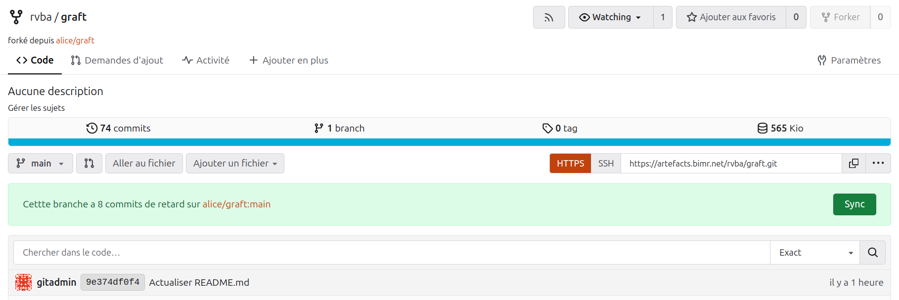

# Federation

## What is Forge Federation?

Should a better distinction be made between **inter-forge collaboration** and **forge-federation**?

- **inter-forge collaboration** would refer to effective tools enabling a fraction a people willing to work together but from their own, separate forges. This would concern local or small teams to work on rather restricted projects with limited access and size.
- **forge-federation** would refer to a more global approach to **social-coding** (or social-hacking) enabling a wider audience to work and share content in the same way they discover new content, and connect with new peers through social platform such as Mastodon. This would concern more global scale open project.

## Mixed approaches

Let's review how to share code between platforms without a dedicated account, starting from the more common and easiest way.

1. Send a patch to a mailing list (Historical Unix/Linux approach, current SourceHut approach)
2. Use Git decentralize architecture (remotes)

## Using remotes

Collaborating between two Forgejo instances

- Two Forgejo instances f1 and f2
- **Alice** have a copy a ``federation-x`` repo on f1
- **Bob** have a copy a ``federation-x`` repo on f2

- Alice commit to federation-x and send a message to Bob asking to update his repo
- Bob add a ``git remote`` to Alice f1 and use ``git pull f1`` to get Alice contribution
- Alice can do the exact same thing on Bob f2
- Now, Alice and Bob can work on the same repo but on two different forge instances
- Question: does having a simple **sync/remote** button solve the collaboration between instances?

## Using graft

Collaborating between two multiple Forgejo instances

Graft's ablility to broadcast git contents across many git platforms (Github, Forgejo, Radicle, ...) automate the manual remote approach, but brings new security issues. Graft needs an **access token** with a **write credential** to your shared repo. This allows any member of the cluster to contribute, but possibly wipe out you entire repo.

A possible solution to adress this security issue would be to have a mix approach using 'traditional' git (forks and/or remotes) with Graft. 

For example, the user **rvba** on the artefacts.bimr.net can create a fork or the shared repo (here Graft) and have a 'sync' and 'open' repo from an internal 'proxy user' (here **alice**).

  * Fork: [rvba/graft](https://artefacts.bimr.net/rvba/graft) (rvba)
  * Proxy: [alice/graft](https://artefacts.bimr.net/alice/graft) (alice)

In this scenario, the user rvba is registered as a **collaborator** within alice proxy repo. The user has now the possiblity to have direct contribution to to shared repo (with a broadcast effect), and/or to have separate branches and work with PR's from his own fork.

